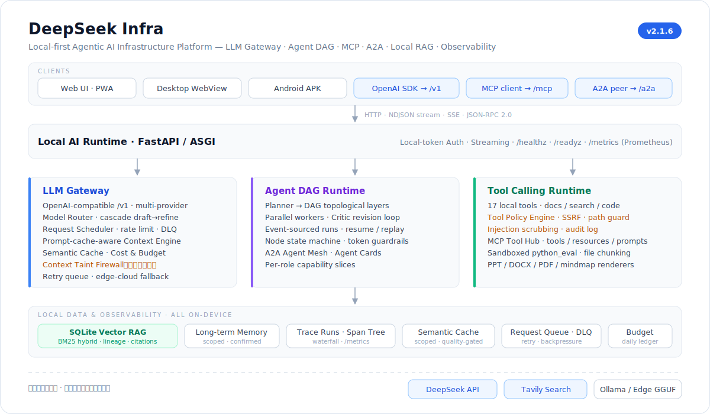
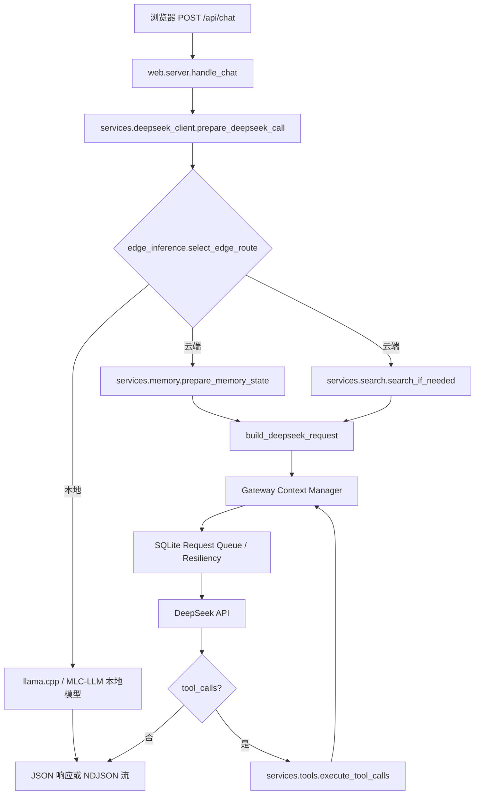

# 架构说明

适用版本：v2.4.6。

DeepSeek Infra 是一个本地优先的 **Agentic AI Infra 平台**：桌面端可通过内嵌 WebView 的本地应用窗口运行，手机端可通过 APK WebView 运行；本机 FastAPI 后端把 LLM 网关（含 OpenAI 兼容 `/v1`）、多 Agent DAG 运行时、本地向量 RAG、工具调用运行时、链路可观测性（`/metrics`、`/healthz`）和端云模型路由组装成一个可私有化、多端运行、可观测、可扩展的 Agentic AI 系统，并以标准协议互操作：本地工具面经 **MCP**（`POST /mcp`）暴露给任意 MCP 客户端，本地 Agent 经 **A2A** 风格的 Agent Card 与任务生命周期（`/.well-known/agent-card.json`、`/a2a`）与外部 Agent 互通。

## 分层架构



```
Client Layer        Web UI / PWA · Desktop WebView · Android APK
      │  HTTP · NDJSON · SSE · OpenAI /v1
Local AI Runtime    FastAPI: Auth · Streaming · /v1/chat · /healthz · /metrics
      │
  ┌───┴───────────────┬───────────────────┐
LLM Gateway        Agent DAG Runtime     Tool Runtime
+ Model Router                           + Sandbox
  └───┬───────────────┴───────────────────┘
      │
Local Data & Observability   Vector RAG · Memory · Trace · Semantic Cache · Request Queue
```

后端代码按基础设施分层组织在 `deepseek_infra/` 下：

- `infra/gateway/` — **LLM Gateway**：策略驱动的模型路由器与级联推理（`model_router`：能力/成本/延迟/回退/cascade，质量门控 + 可选 Judge 评分）、成本与 token 预算治理（`budget_manager`：按模型定价的 USD 费用估算、统一 BudgetPolicy、ToolBudget、每项目每日账本与超预算降级）、Prompt Cache 上下文管理（`context_manager`）、Prompt-cache-aware 上下文工程引擎（`context_engine`：token 预算预估、按模型上下文窗口适配、token 感知裁剪、Context Diff）、网关韧性请求队列（`resiliency`）、端云路由（`edge_inference`）、语义缓存（`semantic_cache`）、OpenAI 兼容门面（`openai_api`，`/v1/chat/completions` + `/v1/models`）、多 Provider 抽象（`providers/`：`BaseLLMProvider` + `DeepSeekProvider` / `OllamaProvider` + `registry` 路由）。
- `infra/agent_runtime/` — **Durable Agent DAG Runtime + A2A Mesh**：`multi_agent` 编排 + `agent_runs` 事件源持久化 / 断线重放 + `agent_state` 节点级状态机与断点续跑 + `a2a`（Agent Card、A2A 任务生命周期、`.a2a/` 持久化与外部委派 client）。
- `infra/rag/` — **Local RAG Data Plane**：`local_rag`（sqlite-vec 向量库 + BM25 词法的 hybrid 检索、增量索引、文档版本、chunk lineage、引用真实性校验、Recall@K 评估）、`files` 解析分块、`context_compressor`。
- `infra/tool_runtime/` — **Tool Calling Runtime**：`tools` 注册执行 + `search` / `ocr` / `documents` / `presentations` / `mindmaps` / `generated_files` / `slides_skill`。
- `infra/mcp/` — **MCP-native Tool Hub**：`server`（JSON-RPC 2.0 分发）+ `registry`（tools / resources / prompts 目录）+ `adapters`（执行桥，复用 Tool Policy 闸门）+ `permissions`（能力切片与预批）+ `client`（出方向 MCP client）。
- `infra/observability/` — **Observability**：`observability`（OpenTelemetry 风格的 trace/span 层级链路，run 为根，`agent.<id>` 包裹其 `context.build`/`memory.retrieve`/`rag.retrieve`/`tool.web_search`/`deepseek` 子 span）+ `trace_api`（`/api/traces`、`/trace/{id}`）+ `export`（trace JSON 脱敏导出）+ `metrics`（Prometheus `/metrics`）+ `health`（`/healthz`·`/readyz`）。
- `infra/data/` — **本地存储**：`memory` / `projects` / `reminders`。
- `core/`、`web/`、`launcher/`、`android_entry.py`、`desktop_app.py` — 配置 / 错误 / 工具、HTTP 运行时、跨端打包入口。

下表按文件列出各模块职责（路径以 `deepseek_infra/infra/` 为前缀，核心/入口层在 `deepseek_infra/` 下）。

## 模块划分

| 模块 | 职责 |
| --- | --- |
| `app.py` | 兼容启动入口，保留 `python app.py` 的使用方式。 |
| `deepseek_infra/app.py` | 进程启动、日志、MIME 注册、缓存清理和 HTTP 服务绑定。 |
| `deepseek_infra/web/server.py` | HTTP 路由、本地 token 鉴权、流式 multipart 解析、JSON/NDJSON 响应和静态文件服务。 |
| `deepseek_infra/infra/gateway/deepseek_client.py` | 请求校验、记忆/搜索编排、Prompt 组装、DeepSeek 同步和流式调用。 |
| `deepseek_infra/infra/gateway/edge_inference.py` | 端侧推理基础设施：可选加载 llama.cpp / MLC-LLM 后端，管理 GGUF / MLC 模型路径、上下文窗口、量化诊断、懒加载卸载和简单任务端云路由判定。 |
| `deepseek_infra/infra/agent_runtime/multi_agent.py` | Leader + 多 Agent 编排：任务拆解、worker 并行调用、搜索预算共享和最终综合。 |
| `deepseek_infra/infra/agent_runtime/agent_runs.py` | 持久化 Agent Run、indexed event log、派生快照（含 `nodes` 节点状态机）、断线重连游标、后台 run registry、计划确认、重跑与断点续跑（`resume_run` / `resume_orphaned_runs`）。 |
| `deepseek_infra/infra/agent_runtime/agent_state.py` | Durable Agent Runtime 的事件源节点状态机：纯函数 `reduce_node_states(plan, events)` 从计划 + 事件日志重放每个 worker 节点的生命周期（created→queued→running→succeeded/failed→retrying→cancelled）与指标（latency / token），并给出 `incomplete_plan_nodes` / `completed_node_ids` 供断点续跑跳过已成功节点。零 I/O，不引入新的实时事件类型。 |
| `deepseek_infra/infra/observability/observability.py` | 本地可观测性存储：SQLite trace run/span、`parent_span_id` 层级链路（OpenTelemetry 风格调用树）、输入/输出摘要脱敏、耗时、usage、prompt cache 命中率和查询函数。span 由 `deepseek_client`（`context.build`/`memory.retrieve`/`rag.retrieve`/`tool.web_search`/`deepseek`）与 `multi_agent`（`agent.planner`/`agent.<id>`/`agent.synthesizer`）通过 `parent_span_id` 串成树。 |
| `deepseek_infra/infra/observability/trace_api.py` | Trace HTTP API：注册 `GET /api/traces`、`GET /api/traces/{trace_id}`、`GET /api/traces/{trace_id}/export.json` 与 `GET /trace/{trace_id}`；独立页面走本地 token 鉴权并由静态 Trace Viewer 渲染。 |
| `deepseek_infra/infra/observability/export.py` | Trace 导出层：递归脱敏 API Key、Authorization、auth token、cookie、password、secret、敏感 URL query，并截断大段 `content` / `text` / `prompt` / `rawContent` 等私有文本，同时保留 token usage、cache hit、span 层级和错误摘要。 |
| `deepseek_infra/infra/gateway/semantic_cache.py` | 本地语义缓存：复用 Local RAG embedding 管线，把可缓存 prompt/response 写入 `.semantic-cache/cache.sqlite3`，在 DeepSeek API 前做相似度命中。v2.0.7 加入缓存版本命名空间（`cache_version` = 版本+embedding 签名）、按 memory/项目 scope 隔离、低质量答案不缓存（`quality_score` 门控）、以及文件上下文的精确命中（exact-match，按项目隔离）。 |
| `deepseek_infra/infra/gateway/budget_manager.py` | 成本与 Token 预算治理（v2.0.10）：按模型定价的 USD 费用估算（`estimate_cost`/`cost_from_usage`）、统一 `BudgetPolicy`（max total/agent tokens、search/tool calls、cost）、`ToolBudget`、每 scope **每日**账本（`.budget/budget.sqlite3`：tokens/cost/model/search/tool calls）、超预算判定与降级（`over_daily_budget`/`should_downgrade`）。`TokenBudget` 扩展为 per-agent 跟踪。 |
| `deepseek_infra/infra/gateway/model_router.py` | 策略驱动 Model Router（v2.0.9）：`route_request` 按能力（图片→vision/pro）、复杂度、成本预算、延迟在 flash/pro 间路由（仅 `autoRoute`/`model="auto"` 时接管，显式选模不变）；`cascade_plan` + `quality_gate`（长度/拒答/不确定/引用不足）驱动级联推理；纯决策与打分，实际调用与 Judge 评分在 `deepseek_client`（`call_deepseek_cascade` / `judge_draft`）。 |
| `deepseek_infra/infra/gateway/context_manager.py` | API 网关 Context Manager：稳定 JSON 序列化、固定工具定义顺序、在已有摘要时执行滑动窗口裁剪，并输出 prompt cache 友好的请求诊断。 |
| `deepseek_infra/infra/gateway/context_engine.py` | Prompt-cache-aware Context Engine：无 tokenizer 的 token 预算预估（按 system/tools/history/dynamic 分项）、按模型上下文窗口适配（`context_window_for_model`，端侧/Ollama/未知模型回落默认窗口）、叠加在条数窗口之上的 token 感知裁剪（`token_trim`，仅在压缩摘要+溢出预算时多丢最旧历史，保留首尾 system 锚点）、以及 Context Diff（稳定 `baseContextId` + 本轮 `delta`）。纯函数、零 I/O，只观测与决策，不改写缓存锚定的 prompt 前缀。 |
| `deepseek_infra/infra/gateway/resiliency.py` | API 网关韧性层：用 `.request-queue/queue.sqlite3` 记录上游请求队列项，对断网、超时、429 和网关类 5xx 做退避重试，并汇总 `gatewayResiliency` 诊断（含 scheduler 快照）。 |
| `deepseek_infra/infra/gateway/scheduler.py` | 本地请求调度层（v2.1.2）：进程内准入控制——优先级队列（交互>Agent>后台，`priority_for_payload`）、并发上限、令牌桶限流（`TokenBucket`）、backpressure（越过 `max_queue_depth` 即 503 卸载）、请求取消与准入超时；`RequestScheduler.lease` 在两处上游调用各包一层。耗尽重试/被卸载的请求落入 `.scheduler/scheduler.sqlite3` 的 Dead Letter Queue（`record_dead_letter`/`dead_letters`/`dlq_status`），`recover_orphans` 在启动时对账既有请求队列的陈旧行（背景恢复）。准入路径纯内存、无每请求 SQLite 写入；`SchedulerOverloaded`/`SchedulerTimeout` 为 503 `AppError`。 |
| `deepseek_infra/infra/gateway/chat_payload.py` | 前端消息展开和附件计数。 |
| `deepseek_infra/infra/rag/context_compressor.py` | 长对话的增量上下文摘要生成。 |
| `deepseek_infra/infra/data/memory.py` | 本地长期记忆 CRUD、作用域过滤、检索排序、显式“记住/忘记”命令解析、记忆建议和冲突检测。 |
| `deepseek_infra/infra/rag/local_rag.py` | 本地 RAG 数据层：SQLite / 可选 sqlite-vec 索引、哈希或 ONNX embedding、文件 chunk 与长期记忆同步、状态诊断和重建索引。v2.0.8 升级为 Data Plane：BM25+向量 hybrid（`bm25_scores`）、内容哈希增量索引与文档版本（`chunk_hash`/`doc_version`/`existing_doc_chunks`）、chunk lineage（`chunk_lineage`：doc/page/offset/hash）、引用真实性校验（`verify_citation`）、RAG Recall@K 评估（`evaluate_recall`）。 |
| `deepseek_infra/infra/data/reminders.py` | 本地提醒队列、到期查询和轻量中文提醒解析。 |
| `deepseek_infra/infra/data/projects.py` | 持久项目空间、项目元数据、项目文档库写入和删除。 |
| `deepseek_infra/infra/tool_runtime/search.py` | 搜索触发、多轮 Tavily 查询、结果聚合、缓存和 Prompt 格式化。 |
| `deepseek_infra/infra/tool_runtime/tools.py` | DeepSeek function calling 本地工具：受限数学计算、缓存文件搜索、公共网页二次精读、提醒、记忆、项目文件、数据转换、图表规格、PPT 生成、Word/PDF 文档生成、SVG 思维导图生成、多查询搜索对比和长期记忆建议。`execute_tool_call` / `execute_tool_calls` 接受可选 `policy`，在分发前过 Tool Policy Engine、成功后清洗结果。 |
| `deepseek_infra/infra/tool_runtime/tool_policy.py` | Capability-based Tool Policy Engine（v2.1.0）：工具元数据 risk card（`ToolMetadata` / `TOOL_METADATA`）、按角色切片的能力画像（`CAPABILITY_PROFILES` / `capability_tools`，`multi_agent.agent_tools_for` 的单一事实源）、轻量 schema 校验（`validate_arguments`）、静态 SSRF 防护（`evaluate_url_safety`）、路径越界检测（`evaluate_path_safety`）、敏感写入拦截、人工确认、`PolicyDecision` / `ToolPolicy` 闸门、工具结果 prompt injection 清洗（`sanitize_tool_result`）、`.tool-audit/audit.jsonl` 审计日志与 `tool_policy_status`。v2.1.5 接入 Context Taint 防火墙：`arguments_contain_secret` 把运行时自身凭证出现在工具参数里的调用一律硬拒绝（`secret_exfiltration_blocked`），污染轮（上下文或中途工具结果检出注入指令）的高风险 / 敏感写入工具升级为待人工确认（`taint_escalated_confirmation`）。纯函数 + 唯一 best-effort 审计 I/O，不 import `tools`，无循环依赖。 |
| `deepseek_infra/infra/evaluation/harness.py` | AI Runtime Evaluation Harness（v2.2.5）：把预测 + golden 标注打成回归指标族——`keyword_coverage`、`recall_at_k`（Recall@K + MRR）、`citation_case`（Citation Accuracy）、`tool_call_score` / `tool_call_accuracy`（工具调用 P/R/F1）、`agent_success`（Agent Success Rate）、`latency_benchmark`、`cost_benchmark`（复用 `budget_manager` 定价）、`keyword_regression`，以及自描述的 `EvalReport`（机器 dict + 人读报告文本）。纯函数、零 I/O、不 import sqlite RAG 层。CLI 编排在 `evals/runners/`，golden 数据在 `evals/golden/`。 |
| `deepseek_infra/infra/tool_runtime/presentations.py` | 本地 `.pptx` 生成：`create_pptx` 工具用 `python-pptx` 生成真实 PowerPoint 文件，普通模型漏调工具时可从文本大纲兜底生成；渲染器会自动加入目录页并选择卡片、流程、对比、观点、总结等版式。 |
| `deepseek_infra/infra/tool_runtime/documents.py` | 本地 `.docx` / `.pdf` 生成：`create_document` 工具用 `python-docx` / `reportlab`（内置中文 CID 字体，无需附带字体文件）把结构化章节渲染成排版精美的 Word 或 PDF，支持标题块、分章节编号、正文段落、要点、表格、页码与按标题哈希确定的配色主题。 |
| `deepseek_infra/infra/tool_runtime/mindmaps.py` | 本地 `.svg` 思维导图生成：`create_mindmap` 工具把模型给出的树状节点渲染成「分组流程图」式 SVG——顶层节点作为带标题的彩色容器（类似 Mermaid subgraph），容器内后代自上而下、用实心箭头连接的圆角卡片，并复用统一下载链路。 |
| `deepseek_infra/infra/tool_runtime/generated_files.py` | 跨格式生成文件的统一生命周期：随机 id 落盘、按后缀解析下载路径（防目录遍历）、MIME 映射、过期清理与“另存到下载目录”，被 `presentations`、`documents` 与 `mindmaps` 共用。 |
| `deepseek_infra/infra/tool_runtime/slides_skill.py` | 用户提供的 `slides` skill 参考文本与运行时路由提示，只在 PPT/幻灯片意图命中时注入本轮上下文。 |
| `deepseek_infra/infra/mcp/server.py` | MCP-native Tool Hub（v2.1.3）的 JSON-RPC 2.0 协议层：`initialize` / `ping` / `tools/list` / `tools/call` / `resources/list`·`read` / `prompts/list`·`get` 分发、标准 JSON-RPC 错误码、通知处理与 `mcp_status()`；经 `POST /mcp` 暴露（本地 token 鉴权，协议版本 `2025-06-18`）。 |
| `deepseek_infra/infra/mcp/registry.py` | MCP 目录：把 `available_tool_definitions()` 映射成带 `inputSchema` 与风险注解（read-only / destructive / open-world，来自 Tool Policy risk card）的 MCP tools；生成产物（`generated://<fileId>`，svg 文本 / 其余 base64 blob）与 `runtime://capabilities` 映射成 resources；`slides-outline` / `research-brief` 两个参数化 prompts。 |
| `deepseek_infra/infra/mcp/adapters.py` | MCP `tools/call` → `execute_tool_call` 执行桥：每次调用构造能力切片的 `ToolPolicy`（schema / SSRF / 路径 / 敏感写入防护与结果清洗全部生效），结果转成 MCP `content`（稳定 JSON text part）+ `structuredContent`，策略拒绝与失败是 `isError` 工具级错误；配置了 Tavily Key 时提供真实 `web_search` 回调。 |
| `deepseek_infra/infra/mcp/permissions.py` | MCP 连接的能力域：`MCP_CAPABILITY` → Tool Policy capability profile（未知回落 `full`）、按连接的工具白名单、`params._meta.approvedTools` 预批解析。 |
| `deepseek_infra/infra/mcp/client.py` / `bridge.py` / `executor.py` | 出方向 MCP client 与 External MCP Tool Bridge（v2.2.1）：`initialize`（含 `notifications/initialized`）/ `tools/list` / `tools/call`、`Mcp-Session-Id` 会话头管理、per-server timeout、retry stats、health snapshot、短期 circuit breaker、policy-gated external call、audit 与 `mcp_external` trace span。默认关闭，只连 `MCP_CLIENT_SERVERS` 显式配置的外部 server。 |
| `deepseek_infra/infra/agent_runtime/a2a.py` | A2A Agent Mesh（v2.2.5）：每个本地 Agent 角色（orchestrator / researcher / coder / reasoner / critic）的 Agent Card（`/.well-known/agent-card.json` 发现 + `GET /a2a/agents` 列表）、JSON-RPC 任务生命周期（`message/send`、`message/stream` SSE artifact chunks / 状态推送、`tasks/resubscribe`、`tasks/get`、`tasks/cancel`、`tasks/list`）、任务状态机（submitted→working→completed/failed/canceling→canceled）、`.a2a/` 任务快照持久化与重启对账（磁盘上残留的非终态任务标记 failed）、外部委派 `A2AClient`（`A2A_PEERS`）。任务在角色 capability 切片内经 `call_deepseek` 执行，绝不超出该角色的工具面；v2.2.5 增加 `scripts/smoke_a2a_compat.py` 与 contract tests 作为外部互操作前置验收。 |
| `deepseek_infra/infra/gateway/context_taint.py` | Context Taint Tracking + Prompt Injection Firewall（v2.1.5）：把组装后的请求按来源分段打信任标签（trusted_system / trusted_user / trusted_memory / trusted_tool 可信；untrusted_web / untrusted_file / untrusted_tool_result 不可信），对不可信段扫描注入、密钥外泄与工具调用指令三类 pattern，产出 `diagnostics.contextTaint` 报告；`harden_search_context`（隔离声明 + 注入红action）与 `file_context_guard_line`（文件上下文确定性 guard 行）做主动加固，字节确定性保证 prompt cache 前缀跨轮稳定。污染判定回流 `ToolPolicy`（taint 升级确认 + 凭证外泄硬拒绝），形成检测→隔离→拦截的闭环。 |
| `deepseek_infra/infra/rag/files.py` | 文件文本抽取、分块、缓存和附件上下文检索；并为豆包式文档阅读工作台提供原文件原样返回、PDF 逐页 PNG 渲染（PyMuPDF，回退 pdf2image）、按页文字坐标层、分页文本和跨页关键字搜索。 |
| `deepseek_infra/infra/tool_runtime/ocr.py` | 可选 OCR：优先用 DeepSeek API 直接转写图片；API 不可用时再回退到 Android ML Kit、Windows OCR、Tesseract 或本地公式 OCR；支持扫描 PDF 转图识别和图片文字识别。 |
| `deepseek_infra/core/config.py` | 不可变设置、环境变量解析、兼容常量和 JSON 日志。 |
| `deepseek_infra/core/errors.py` | `AppError` 和稳定 API 错误码。 |
| `deepseek_infra/core/utils.py` | 模型名、评分、文件名、时间戳、token URL 和局域网 IP 工具函数。 |
| `deepseek_infra/desktop_app.py` | Windows 本地桌面应用壳：启动本机 HTTP 后端，用 `desktop=1` token 入口完成 WebView Cookie 握手，并用 pywebview 打开内嵌应用窗口。 |
| `deepseek_infra/android_entry.py` | Android APK 的 Chaquopy 桥接层：设置应用私有数据目录，启动/停止本机 Python HTTP 服务，并把带 token 的 WebView URL 返回给原生 Activity。 |
| `android/` | Android Studio / Gradle 工程：原生 WebView 壳、Chaquopy 打包配置、Android 权限和 APK 资源。 |

前端使用原生 ES modules，不引入打包工具。`static/app.js` 只负责启动 `static/modules/chat.js`；`network.js` 处理 token、认证头、API 请求和上传；`markdown.js` 处理 Markdown、代码块和公式 glue；`settings.js` 放 PWA 注册等设置侧辅助；`panels.js` 放跨面板纯工具。v0.8.2 起，图表、朗读文本、流式解析、格式化、规范化和提醒短语解析等纯函数拆到独立模块；v2.2.0 新增 `static/trace_viewer.html`、`trace_viewer.js` 与 `trace_waterfall.js`，把 trace span 树、瀑布图和类型耗时汇总抽成独立只读页面。索引见 `docs/FRONTEND_MODULES.md`。`math_core.js` 和 `seek_core.js` 仍以全局 IIFE 方式加载，避免扩大迁移面。

v0.7.4 的 UI/UX 能力都保留在前端：命令面板和全局快捷键由 `chat.js` 统一处理；主题与字号通过 CSS 变量写入 `document.documentElement`；离线壳在 `/api/config` 失败时切换 `offlineMode`，只允许查看本地历史；代码块、公式复制、Mermaid 轻量 flowchart 和表格 SVG 图表由 `markdown.js` 输出结构，`chat.js` 负责点击行为。
v0.8.2 的手机输入能力仍保持前端优先：语音输入使用浏览器 `SpeechRecognition` / `webkitSpeechRecognition`，语音语言保存在 `localStorage`；回复朗读使用 `speechSynthesis`，播放前会清理公式、引用 pin、表格分隔符和代码块，再按短句排队播放。“引用所选”监听浏览器 selection，只在选区实际命中单条聊天消息气泡时启用输入区按钮；用户消息和助手消息都可作为引用来源。点击后把片段写入 `state.quoteDraft`，下一轮请求由 `quoteAwareContent()` 注入“关于上文中的这一段”提示。PWA Share Target 是唯一新增的入口流：`POST /share-target` 只做 Host 白名单校验并把分享内容写入内存缓存，随后通过 `303 /?share=<id>` 回到 SPA；真正读取缓存的 `GET /api/share-target` 仍走本地 token 鉴权，前端确认后才写入草稿和附件列表。v0.8.3 的图标链路保持纯静态：`static/icons/` 放 SVG、favicon PNG、Apple touch icon、PWA any/maskable PNG 和通知 badge，`manifest.webmanifest` 只引用这些本地资源，`static/sw.js` 预缓存整套图标并在 Web Notification 中使用真实 icon/badge。

v0.8.4 的动效层仍由原生 CSS 和少量 DOM 状态完成：`static/styles.css` 定义统一 motion token、按下反馈、面板/遮罩过渡、消息和 Toast 入场动画，并尊重 `prefers-reduced-motion`。`chat.js` 只给新创建消息标记短暂 `data-fresh`，同时把流式输出更新放进 `requestAnimationFrame` 队列，避免每个 token 事件都立即重绘。

v0.8.5 继续保持前端本地状态边界：思考摘要只根据当前消息对象的 `streaming`、`content` 和完成时间渲染，不新增协议字段；“引用所选”在按钮按下阶段缓存最近有效的消息选区，避免浏览器焦点切换清空 selection 后丢失片段。v1.6.6 通过 `scheduleSelectionRefresh()` 在 `mouseup`、`keyup` 和 `touchend` 后延迟刷新选区，并让触屏 `touchstart` 不再阻断后续 click。

v0.8.6 为前端消息对象增加可选 `reasoningEndedAt` 字段：首个正文 `content` 流事件到达时记录，用于把“思考用时”固定在思考阶段结束时；旧消息没有该字段时回退到 `completedAt`。v1.7.7 在诊断面板基础上新增 Trace 入口：响应的 `diagnostics.traceId` 会让助手消息更多菜单显示 `Trace`，点击后读取 `/api/traces/{traceId}` 并在同一侧栏渲染 DAG waterfall。`loadConfig()` 同时读取 `tracing` 与 `semanticCache` 状态，但前端请求协议不需要为了 trace 额外传字段。v1.7.5 在 v1.7.0 的 `streamPhase` 基础上新增端侧推理状态读取：`/api/config` 的 `edgeInference` 决定普通聊天是否能在无云端 API Key 时发送，本轮响应的 `diagnostics.edgeInference` 进入诊断面板。运行中的消息继续用 `streamPhase` 区分思考、工具调用、搜索、Agent 工作和正文输出，并在请求启动时开启 Activity 标题刷新；流式期间标题显示整轮活跃耗时，完成后再回到固定的思考耗时。`state.busy` 只表示有模型请求在途，发送、重生成、分叉和编辑仍会被拦截，但输入框、附件准备、语音输入、朗读和引用所选保持可用。

v0.9.0 的侧边栏重构仍保持零 JS 迁移：所有按钮 id 不变，只在 `index.html` 中移动入口位置，并通过 `styles.css` 把历史面板改为 header / list / footer 三段式 flex 布局。历史列表独立滚动，底栏固定在面板底部，历史项隐藏时间 meta 行以接近单行标题列表。

v0.9.1 强化 DeepSeek function calling 链路：工具调用回合会把 assistant 的 `content` 和 `reasoning_content` 一起追加回下一轮请求，满足 V4-Pro thinking 模式对完整推理内容回传的要求（缺失 `reasoning_content` 时上游会直接报错）。内置工具定义启用 strict schema，工具描述包含使用边界；系统提示会鼓励模型在多个独立 URL 或文件检索时并行发起工具调用。前端设置面板新增思考强度，发送请求时通过 `reasoningEffort` 传给后端。
v0.9.2 扩展上传与前端交互层：`core.config.FileSettings` 新增 200MB 单文件上限和 220MB multipart 请求体上限，`web.server.read_multipart_form()` 在 `/api/file-text`、`/api/project-files` 和 PWA Share Target 入口统一校验，`/api/config` 下发 `uploadLimits` 供前端预检。v0.9.3 将自动联网搜索从后端关键词预判改为模型驱动的 `web_search` 工具循环：auto 模式只暴露工具，force/on 模式保留 round 1 预取，后续搜索由模型继续决定。v0.9.4 在搜索结果中分配 `[^Wn]` 引用、增加 `/api/title` 标题生成端点，并在前端以本地 timeline 保留 reasoning/search 事件顺序。v0.9.6 修复搜索 timeline 的 SVG 图标、卡住状态和引用候选去重，并扩展本地工具集；安全的相邻工具可并行执行，提醒、记忆删除和记忆建议等副作用工具保持串行。v1.0.0 将前端外观升级为 `data-theme` × `data-mode` 的主题系统，首屏 inline boot script 负责提前写入主题 dataset，`styles.css` 通过语义 token 支撑 ChatGPT、Linear、Notion 和 Arc 四种风格。前端仍不新增打包工具，`chat.js` 直接管理拖拽/粘贴附件、图片本地缩略图和 lightbox、应用内确认弹窗、toast action、快捷键速查、live region、焦点陷阱、软键盘安全区变量和选区浮动引用提问。v1.0.1 恢复 force/on 模式下最多 3 条互补预取查询，并在中断、刷新或历史恢复时把遗留的 `searching` 搜索轮收尾为错误状态。v1.1.1 仅调整 `static/styles.css` 的主题 token 和主题特定规则，强化四套视觉风格在 light / dark / system 下的一致性和辨识度。v1.1.5 在同一 `/api/chat` 流式入口上增加 `agentMode` 分支，由 `multi_agent.py` 运行 Leader/worker/Synthesizer 编排；搜索工具增加普通 turn 硬上限和多 Agent 共享预算，前端同时清理持久化的顶层 `message.search` 状态。v1.2.5 保持 Researcher 和 Critic 层间串行，只让 Coder / Reasoner 中间层并行；worker 的 `content`、`reasoning`、`search` 分别转成 `agent_delta`、`agent_reasoning`、`agent_search`，前端按 `phase` 写入对应 Activity Agent 卡片。v1.2.6 增加 Agent 展示模式、已完成卡片默认折叠、稳定 Agent step id 和 request-level cancel token；worker 工具状态改为独立 `agent_note`，详细模式显示，简洁模式隐藏。v1.2.7 把 agent timeline 的纯函数抽到 `static/modules/agent_timeline.js` 独立模块；`createAgentStepId(message, phase)` 给 Leader 两轮（拆解 + 综合）生成不同 id，`normalizeTimeline` 给旧 history 重复 id 补号去重；折叠策略改为 Leader / 错误 Agent 默认展开、其他完成 worker 默认折叠。后端 `execute_tool_calls` 在 `cancel_event` 已 set 时跳过真实工具调用、并行 middle tier 在 cancel 后通过 `emit_gate` 吞掉 worker 的 `agent_delta`，前端 timeline 不会在用户点"停止生成"之后继续冒字。v1.2.8 在多 Agent 事件协议上扩展两个字段：done / error 事件携带 `durationMs`（毫秒整数），由 `multi_agent.py` 在 Leader 拆解 / Leader 综合 / 串行 worker / 并行 worker / 超时 fallback 各分支用 `time.monotonic()` 配对计算；失败 Agent 的输出多带一个 `failed: True` 标记，让 `synthesis_messages` 在 user prompt 末尾追加"以下 Agent 本轮执行失败"提示，引导 Synthesizer 在最终回答里告知用户该角色缺席。`execute_tool_calls` 在 results 组装前再做一次 cancel 判定，把并行 batch 中途取消时未拿到 result 的 slot 统一替换为 cancelled output，cancel 语义在前后端各层保持一致。v1.2.9 不改后端多 Agent 架构，集中修复前端 timeline 持久化：`normalizeDurationMs()` 让 `durationMs: null` 保持为无耗时数据，Activity 摘要条显示 "N 个 Agent"，失败 chip 以轻量边框突出。v1.3.0 开始把多 Agent 做成工作台体验：`agentExecutionReport(message)` 从前端 timeline 生成可复制的 Agent 执行报告；后端在 `done.diagnostics.agentDurations` 中输出 worker 耗时表，便于性能诊断。

v1.3.4 保持多 Agent DAG 不变，重点修 Activity 面板的前端状态边界：用户手动关闭某条流式消息的 Activity 侧栏后，`chat.js` 会把该 message id 加入 `activityAutoDismissedMessageIds`，后续 token 不再触发自动打开；用户手动点击“思考与活动”会清掉该标记。Activity 渲染现在会在 timeline 缺少 reasoning step 时把 `message.reasoning` 作为 fallback 补回，避免 Leader 思考在切到 worker Agent 后消失。Agent 模式会固化到 assistant message，用于稳定 75 分钟前端请求超时和面板打开条件。

v1.3.5 保持 DAG 和事件协议不变，调整 worker 请求前缀结构：`systemPrompt` 只保留原系统提示、Agent 角色提示、安全/搜索权限约束和四段输出模板；`build_prior_context()` 生成的前序 Agent 摘要与当前子任务由 `agent_messages()` 追加到历史对话之后。这样动态内容不会插在稳定 system prompt 与长历史之间，DeepSeek prefix cache 更容易命中可复用的历史前缀。

v1.3.6 进一步统一 worker `systemPrompt`：不同 Agent 的 `profile["system"]`、搜索权限说明、前序摘要和当前子任务全部由 `agent_messages()` 追加到历史之后。请求前缀因此变为“统一 system prompt → 同一份历史对话 → 动态 Agent 指令”，让同一轮多个 worker 也能尽量共享 DeepSeek prefix cache。

v1.3.7 不再改 prompt 结构，只补多 Agent cache 观测链路：`_run_agent_once()` 保留每个 worker 的 `usage`，`synthesize_answer()` 捕获 Synthesizer 的 `done.usage`，最终由 `agent_cache_for_diagnostics()` 汇总为 `done.diagnostics.agentCache`。这让性能诊断能区分 prefix cache 实际未命中和 UI 未展示聚合数据。

v1.3.8 继续只打磨 cache diagnostics：`cache_usage_summary()` 以 `totalTokens > 0` 判断 `hasData`，无数据时 `hitRate=null`，真实全部 miss 时保留 `0.0%`。前端诊断面板据此显示“无数据”或具体 hit/miss，避免把失败、取消或上游未返回 usage 误判成缓存完全未命中。

v1.3.9 只做诊断面板显示层 polish：Agent cache label 中文化，`formatAgentCacheByAgent()` 输出多行文本，`.diagnostics-row.is-multiline` 负责排版；后端多 Agent 编排、prompt 前缀结构和 cache 统计口径均不变。

v1.4.0 把多 Agent 从一次长 `/api/chat` 请求升级为可恢复 Agent Run。浏览器先 `POST /api/agent-runs` 创建 run，后端在 `.agent-runs/run_*.json` 中保存状态、计划、事件日志和派生快照，再由 `AgentRunRegistry` 启动后台线程执行。前端随后 attach `GET /api/agent-runs/{runId}/stream?after=N`；如果刷新、断网或手机息屏，重新读取 run detail/events 后从最后 `index` 继续接收。服务进程重启不会恢复旧线程，启动时会把遗留 `created` / `planning` / `running` run 标记为 `orphaned`。

Agent Run 的事件日志是恢复 UI 的唯一事实源。`agent_runs.append_event()` 原子追加带 `runId`、`index`、`createdAt` 的事件，然后从事件更新 `finalAnswer`、`agentOutputs`、`diagnostics` 等快照。快照只服务快速读取；如果二者冲突，应优先按 events 重放。写入 run JSON 时使用唯一临时文件并对 Windows 短暂锁文件做替换重试，避免高频事件持久化时出现 `.json.tmp -> .json` 的拒绝访问。重跑 worker 时先发 `agent_reset` 清掉对应 Agent 卡片，再运行该 worker；需要重新综合时发 `final_reset` 清空最终答案。1.4.0 不做依赖级联重跑，重跑 Researcher 不会自动重跑 Coder / Reasoner / Critic。

1.4.0 的 Agent 搜索预算仍只开放给 Researcher，但上限提高到单次 Agent Run 总计 12 次、单 Researcher 5 次，并允许 worker 工具循环最多 4 轮，方便“搜索 → 精读/比较 → 再补搜”的长资料任务；普通 `/api/chat` 搜索预算不随之放大。

## 聊天流程



v1.7.7 的观测和缓存位于 `deepseek_client` 请求编排层。每轮请求先通过 `observability.ensure_trace()` 拿到 `traceId`；多 Agent 模式会在 `stream_multi_agent()` 创建共享 trace，再由 Planner、worker、Critic 修订和 Synthesizer 透传同一个 `traceId`。云端调用前会先执行 `semantic_cache.lookup()`，只有无工具、无搜索、无附件且相似度达到阈值时才直接返回缓存；否则继续请求 DeepSeek，并在成功后把可缓存结果写入 `.semantic-cache/cache.sqlite3`。所有上游请求、端侧请求和缓存检查都会写入 trace span。

v1.8.0 在 `deepseek_client` 与真实 `urlopen` 之间加入 API 网关层。`context_manager.manage_request_body()` 会在请求发出前稳定工具定义顺序和 JSON 序列化，并在已有 `contextSummary` 时裁剪为“稳定前缀 + 最近消息 + 尾部 dynamic context”的滑动窗口。`resiliency.open_with_resiliency()` 会为每次上游请求写入 `.request-queue/queue.sqlite3`，遇到断网、超时、HTTP 408/425/429/502/503/504 时把队列项标为 `queued` 并退避重试；成功或耗尽后写回 `succeeded` / `failed`。普通聊天和 Agent worker 共用这层，因此手机网络短暂切换时，后台 Agent Run 可以继续等待网络恢复，而不是立即把 worker 置空。

稳定 Prompt 前缀会尽量保持小而固定。首个 system message 只放角色提示和通用工具提示；`contextSummary`、长期记忆、当前本地/UTC 时间、搜索工具提示、搜索结果和继续生成上下文都会作为本轮尾部 dynamic system message 追加。这样打开/关闭搜索、刷新搜索结果或时间变化时，只会影响尾部动态块，不会让前面的长历史从 system message 后就全部 cache miss。

v1.6.3 将 Windows exe 的默认路径改为 `deepseek_infra/desktop_app.py`：入口先在当前进程启动 `127.0.0.1` 本机 HTTP 后端，再用 pywebview 打开内嵌应用窗口。v1.6.6 的 `webview_entry_url()` 会给 token URL 追加 `desktop=1`，服务端验证后直接返回首页并写入 Cookie，避免 WebView 在 302 跳转中丢认证；旧图形启动器仍通过 `--gui` 保留，纯后端模式仍通过 `--server` 保留给打包验证和内部启动。v1.6.0 新增手机本机启动路径：`deepseek_infra/launcher/mobile.py` 在导入后端配置前先解析手机控制台参数和环境变量，随后调用 `prepare_and_start(host, port, serve=False)` 复用同一个 HTTP 服务；`launch.py` 在检测到 Android/Termux/Pydroid 环境时自动走该控制台启动器。手机模式不导入 `gui.py`，因此不依赖 Tk 或 `customtkinter`。v1.5.1 继续收紧前端交互底座：Activity 面板复制 Agent 过程只走事件委托，避免重复触发；Escape 会统一关闭当前可见的工作台面板；焦点陷阱改为栈式管理，确认框叠在设置、项目、搜索或 Activity 面板上时，关闭后仍能恢复到底层面板的键盘焦点循环。

## 对话与生产力

v0.7.0 在前端会话层增加轻量生产力能力。对话仍以兼容旧数据的 `messages` 数组展示，但创建分支时会生成带 `branchParentId`、`branchFromMessageId` 和 `branchLabel` 的新 conversation，旧走向不会被覆盖。历史列表会展示分支来源、收藏状态和标签；标签、收藏、Seek 快照和消息内容共同参与历史全文搜索。

输入框草稿每约 2 秒写入浏览器 `localStorage`，包括文本、未发送附件元数据和引用消息快照。页面恢复时会提示用户恢复或丢弃草稿。消息引用回复不会改变原消息，只是在下一条 user 消息前自动加入 Markdown 引用块。

本地提醒由前端识别“提醒我”类输入并调用 `/api/reminders` 创建任务；后端把任务写入 `.reminders/reminders.json`。前端定时调用 `/api/reminders/due` 获取到期任务，再通过 Service Worker 的 `showNotification` 显示系统通知。提醒只在本地保存，不进入模型请求。

## 项目空间与文档库

v0.7.1 增加持久项目空间。项目元数据写入 `.projects/{projectId}/project.json`，项目文档索引写入 `.projects/{projectId}/files/{fileId}.json`。这条路径和临时附件 `.file-cache` 分离，因此不受 14 天 / 500 MB 临时缓存清理影响；用户删除项目时才会删除对应项目目录。

前端通过项目侧栏创建、切换和上传文档。发送消息时，当前项目会生成 `projectId`、`projectName` 和 `projectAttachments` 快照，并与普通附件、Seek 参考文件一起合并到 user 消息的 `attachments`。后端的 `build_attachment_context()` 根据每个附件的 `projectId` 决定从项目文档库或临时缓存读取索引。

文件 chunk 在写入时会同步进入 `.local-rag/rag.sqlite3`。默认路径是无额外依赖的 SQLite 元数据表 + 本地哈希 embedding；安装 `requirements-rag.txt` 后，`sqlite-vec` 会加载 `vec0` 虚表，查询时优先用本地 KNN 结果，再叠加关键词分数和相邻 chunk 扩展。配置 `LOCAL_RAG_EMBEDDING_PROVIDER=onnx`、`LOCAL_RAG_ONNX_MODEL_PATH`、`LOCAL_RAG_TOKENIZER_PATH` 后，embedding 会改由 ONNX Runtime 在本机生成。没有 native 依赖或 ONNX 模型时，系统自动回退到哈希 embedding，不改变前端附件协议。

模型看到的附件上下文会包含稳定引用 ID，例如 `F1-2`。前端 Markdown 渲染器会把 `[^F1-2]` 转成引用 pin，点击后调用 `/api/file-chunk` 读取对应文件片段并打开预览面板。

## 联网搜索

联网搜索由 `services.search` 编排。前端的搜索模式包括关闭、自动和强制；自动模式会由后端根据用户问题判断是否需要搜索。`/api/config` 中的 `hasSearch` 只表示服务端是否配置了 `TAVILY_API_KEY`，前端还会结合设置面板里填写的 Tavily Key 计算搜索按钮是否可用。多轮搜索会并行执行各个 query，聚合结果仍按 round 编号排序，进度事件按实际完成顺序更新。

发起 `/api/chat` 时，前端会在本轮请求中携带可选的 `tavilyApiKey`。后端优先使用请求级 Key；如果没有提供，则回退到服务端环境变量 `TAVILY_API_KEY`。这样电脑端没有预设 Tavily 环境变量时，手机浏览器仍可在设置里临时填写 Key 后启用联网搜索。

## 本地工具调用

v0.7.2 在 DeepSeek 请求层接入 function calling；v0.7.3 增加 `suggest_memory`。`build_deepseek_request()` 默认把 `python_eval`、`search_files`、`fetch_url`、`web_search`、`suggest_memory` 以及 v0.9.6 的提醒、记忆、项目文件、数据转换、图表、PPT 生成、Word/PDF 文档生成、SVG 思维导图生成和多查询搜索对比工具定义加入请求体；如果前端传入 `toolsEnabled: false`，则不发送工具定义。用户请求“做 PPT / 幻灯片 / 演示文稿”时，普通聊天会把本轮动态上下文标记为 `slides` skill（PowerPoint-style presentations，可参考 pptxgenjs / artifact tool 路线），并把 `tool_choice` 强制为 `create_pptx`；若上游最终仍未返回工具调用，`ensure_pptx_response()` 会把模型文本大纲交给 `presentations.create_presentation_from_text()` 兜底生成文件。`create_pptx` 的每页可带 `layout`，本地渲染器会生成目录页并根据标题/要点选择卡片、流程、对比、观点或总结页，避免纯 bullet deck。`create_document` 工具则用 `python-docx` / `reportlab` 把 `format`（docx/pdf）+ 结构化 `sections`（标题、正文段落、要点、可选表格）渲染成排版精美的 Word 或 PDF，并复用同一套 `/api/download` 下载链路；与 PPT 不同，文档链路只依赖模型主动调用工具，没有从文本兜底生成的步骤。用户请求“画思维导图 / 脑图 / mind map”时，后端会把 `tool_choice` 强制为 `create_mindmap`，DeepSeek 输出 `title`、可选 `subtitle` 和树状 `nodes`，本地渲染器生成 `.svg` 文件；最终回复使用 Markdown 图片语法，前端 `markdown.js` 只把本地 `/api/download?id=...` 这类生成文件图片块渲染为正文预览，并保留下载链接。`web.server.handle_chat()` 会注入 `localBaseUrl`，最终回复里的 `/api/download` 会重写成当前本地服务地址，避免 WebView 把相对链接解析到外部站点。

同步调用由 `call_deepseek()` 驱动工具循环：当 DeepSeek 返回 `tool_calls` 时，后端调用 `services.tools.execute_tool_calls()`，把结果作为 `role=tool` 消息追加到请求，再向 DeepSeek 发起下一轮请求。流式调用会在 SSE delta 中拼接 `tool_calls` 参数，执行工具后通过 `system_note` 告知前端，然后继续下一轮流式请求。v1.6.1 起，后端会在追加工具交换时保留上游原始 `tool_call_id` 和参数 JSON，使第二轮请求可以匹配上一轮模型输出末尾的 DeepSeek prompt cache；模型侧工具结果仍用稳定 JSON 序列化，`web_search` 单轮工具查询也会复用 `.search-cache`，减少工具结果后的 DeepSeek prompt cache 提前分叉。`create_pptx`、`create_document` 和 `create_mindmap` 是终态产物工具：执行成功后后端会直接返回本地下载链接并结束本轮，不再把大段工具参数和结果追加后再请求一次 DeepSeek；它们的工具结果也会压缩为下载元数据与简短结构摘要，避免完整大纲/正文重复进入 prompt。`append_tool_exchange()` 只在末尾追加 assistant 工具调用消息（含 V4-Pro thinking 模式必需回填的 `reasoning_content`）和工具结果，使每一轮请求都是上一轮 messages 的严格前缀延伸、不改写已有消息——这是工具循环 prompt cache 能命中的前提；达到轮次上限改直接作答时，`force_final_answer_without_tools()` 也保留 `tools` 数组、仅用 `tool_choice="none"` 禁用工具，避免体量最大的收尾请求因删掉 `tools` 前缀而整段 miss。v1.6.0 起普通工具循环会把每次上游请求返回的 usage 累加后再生成最终 `usage` 与 cache diagnostics，避免最后一次强制最终回答请求覆盖前面工具回合的 cache hit 数据。`web_search` 工具会把 Tavily 单轮搜索结果压缩后返回给模型，并把搜索 rounds 作为前端进度事件持续更新。同一回合重复 query 会复用缓存结果。v0.9.6 起，安全的相邻工具调用会并行执行并按原顺序回填结果；`create_reminder`、`forget_memory`、`suggest_memory` 和共享搜索 timeline 的工具保持串行。两种模式都最多允许 5 轮工具调用，避免模型陷入无限循环。

`python_eval` 通过隔离的 Python 子进程执行表达式，只允许小型数学 AST、受控函数和 2 秒超时；`data_transform` 只支持 `extract_regex`、`json_path`、`csv_summary`、`number_summary`，不执行用户代码；`search_files` 只读取本地 `.local-rag`、`.file-cache` 与 `.projects/{id}/files` 索引，优先走 SQLite / sqlite-vec 本地向量命中，失败时回退到 JSON 分块扫描；`list_project_files` / `read_file_chunk` 只走项目文档库和缓存 chunk；`fetch_url` 会先做 URL 和解析后 IP 校验，拒绝本地/私有/保留地址，再读取最多 2 MB 页面并写入 `.search-cache`；`suggest_memory` 只生成待确认建议，由前端弹窗让用户决定是否保存。

## 长期记忆

长期记忆保存在 `.memory/memories.json`，写入时使用进程内 `RLock` 和 `.memory/memories.lock` 跨进程锁保护读改写流程。每条记忆包含 `content`、`category`、`scope`、时间戳和稳定 id；`scope` 支持 `global`、`project:<id>` 和 `seek:<id>`。

`prepare_memory_state()` 会根据请求的 `memoryScope`、最新 user 消息的 `projectId` 或 `seekId` 推断当前作用域。检索时只读取全局记忆和当前项目 / Seek 相关记忆，避免 A 项目里的背景被 B 项目对话误用。显式“记住：...”会写入当前作用域；“忘记 ...”只在全局和当前作用域内删除。

模型可通过 `suggest_memory` 工具提出记忆建议。后端会先做敏感内容拦截和轻量冲突检测，然后通过 `memory_suggestion` 流事件或非流式响应的 `memorySuggestions` 返回给前端。只有用户确认后，前端才会调用 `/api/memory` 写入；如果存在冲突，保存接口返回 `memory_conflict`，用户确认替换后再带 `replaceIds` 重试。

## Seek 助手

Seek 助手是前端本地能力，推荐 Seek 和自定义 Seek 由 `static/app.js` 管理，通用的规范化、快照解析、同名检查、参考文件规范化和已知 id 判断放在 `static/seek_core.js`，便于用 Node 做纯函数测试。自定义 Seek 保存在浏览器 `localStorage`，包含名称、简介、专属指令、开场提示和参考文件元数据。

发送消息时，前端会把当前 Seek 写入 user/assistant 消息快照，包括 `seekId`、`seekName`、`seekDescription`、`seekInstructions` 和 `seekReferenceAttachments`。后续继续生成、重新生成、编辑后重发、上下文压缩和 Markdown 导出都会读取消息快照，而不是读取当前全局 active Seek。这样即使用户中途切换或删除自定义 Seek，旧历史仍能显示当时的助手名称，并保持原来的系统提示词和参考文件语义。

Seek 参考文件复用普通附件上传链路：编辑自定义 Seek 时，前端调用 `/api/file-text` 解析文件并保存返回的 `fileId`、文件名、分块数量和预览文本。实际请求 `/api/chat` 时，普通聊天附件仍只显示在用户消息上；Seek 参考文件会在构建 API 消息时合并到 user 消息的附件列表，交给 `services.files.build_attachment_context()` 按当前问题检索相关片段。assistant 消息只保存 Seek 快照，不把参考文件作为 assistant 附件展开。

输入区会持续渲染当前激活的 Seek 助手提示条，并提供停用按钮。卡片上的“停用”按钮走同一条 `setActiveSeek("")` 路径。点开场提示会创建新对话，避免把不同 Seek 助手混在同一段历史里。

自定义 Seek 支持 JSON 导入/导出。导出的结构由 `seek_core.seekExportPayload()` 生成，包含类型标记、版本号、导出时间和规范化后的自定义 Seek 列表；v2 格式会保留参考文件元数据和本地 `fileId`。导入由 `seek_core.mergeImportedSeeks()` 统一处理，负责校验字段、跳过无效项、处理重名和 id 冲突，并继续遵守最多 40 个自定义 Seek、每个 Seek 最多 6 个参考文件的本地上限。推荐 Seek 不会直接被修改，用户可以把推荐卡片复制为自定义 Seek 后再编辑。

历史列表会用 `conversation.seekId` 查找当前仍存在的 Seek；如果 Seek 已删除，则回退到消息快照中的 Seek 名称。这让旧对话在数据清理后仍然可读，也方便按历史标题快速辨认当时使用的助手。

## 公式渲染

公式生成和展示由前端处理。`static/app.js` 会在稳定系统提示词中追加公式输出约束，引导模型把行内公式写成 `\( ... \)`，把独立公式写成 `\[ ... \]` 或 `$$...$$`。这样后端仍只接收普通 `systemPrompt`，不需要新增 API 字段。

`static/math_core.js` 提供可测试的公式边界识别能力，保留 `\( ... \)`、`$...$` 的提取逻辑和货币符号误判保护；真正的 LaTeX 排版交给本地自托管的 KaTeX 0.16.45。`static/index.html` 先加载 `/vendor/katex/katex.min.css` 和 `/vendor/katex/katex.min.js`，再加载 `math_core.js` 与 `app.js`，因此公式会通过 KaTeX `renderToString()` 输出 HTML。

KaTeX 的 JS、CSS、woff2 字体和许可证都放在 `static/vendor/katex/`，不依赖外部 CDN。Markdown 渲染器会先保护行内代码和代码块，再识别公式，避免把示例源码里的 `$` 或反斜杠误渲染。若 KaTeX 尚未加载，前端会先输出 `.math-pending` 占位并在 `load` 后补渲染；解析失败时使用 `.math-error` 展示原始公式文本。KaTeX 以 `trust: false`、`throwOnError: false`、`strict: "ignore"` 运行，矩阵、分段函数、对齐公式等环境由 KaTeX 负责支持。流式生成期间，如果块级公式的闭合 fence 还没到达，前端会暂时按普通文本展示原始公式，等 `$$` 或 `\]` 闭合后再交给 KaTeX，避免半截公式反复显示红色错误。

## 上下文压缩

当前端发现历史过长时，会先调用 `/api/compress-context` 生成或更新摘要。后端在未提供 `contextSummary` 且有效 user/assistant 消息超过 40 条时返回 `context_compression_required`，避免静默滑窗导致历史丢失和 prefix cache 失效。

## 附件流程

上传走 `POST /api/file-text`。后端使用 `multipart>=1.3,<2` 的流式 parser 读取表单，抽取文件文本、分块并写入 `.file-cache/{fileId}.json`。项目文档上传走 `POST /api/project-files`，复用同一解析链路，但写入 `.projects/{projectId}/files/`。如果运行环境里的 `multipart` 命名空间被不兼容包覆盖，服务端会在解析前做能力校验并返回明确错误。聊天消息只保存附件元数据；发送消息时，`services.chat_payload.expanded_message_content()` 会调用 `services.files.build_attachment_context()`，按当前问题检索最相关的文件片段。

扫描版 PDF 会先尝试原生文本抽取；没有可复制文字时才进入 OCR。PNG、JPG、WebP、BMP、TIFF、GIF 等图片会被识别为 `kind=image`，并在 OCR 开启时通过 `services.ocr.extract_image_ocr()` 提取文字。OCR 候选链优先使用 `DeepSeekApiOcrEngine`，把图片或 PDF 页面 data URL 发给 `deepseek-v4-pro` 直接转写；API Key 缺失、API 失败或返回空文本时，再回退到本机引擎。扫描 PDF OCR 仍需要 Poppler / `pdftoppm` 把页面转图；渲染 DPI 来自 `OCR_PDF_DPI`（默认 300，限制 150..450），超大图片会按 `OCR_MAX_IMAGE_PIXELS` 等比缩小。

Tesseract 路线的 `OCR_MODE=fast|balanced|quality` 控制本地轻量增强档位：`fast` 少重试，`balanced` 默认使用 Otsu/自适应阈值/弱光增强候选和多个 `psm`，`quality` 额外尝试轻量倾斜校正。为提高公式截图可读性，Tesseract 参数会保留词间距并补跑单行/原始行模式；若本机安装了 `equ` 公式语言包，也会自动加入语言组合。

公式 OCR 可以通过 `OCR_FORMULA_CMD` 接入本地命令行引擎，命令模板中的 `{image}` 会替换成临时图片路径；未显式配置时会自动尝试 PATH 中的 `pix2tex` 或 `latexocr`。命令输出可以是纯文本、Markdown 代码围栏或带 `latex`/`text`/`result` 字段的 JSON。DeepSeek API 返回非空结果时会直接采用；本地公式 OCR、Tesseract、Windows OCR、Android ML Kit 用于 API 不可用或空结果时的降级。OCR 仅在全局开启或上传请求携带 `ocrEnabled=1` 时运行。

### 文档阅读工作台（豆包式原样阅读）

上传 PDF / 图片 / 纯文本类附件后，点击「预览」会打开文档阅读工作台。其判定与布局完全在前端 `chat.js`：当文件预览面板打开、且当前对话还没有消息、且屏幕宽度 ≥960px 时（`isFileReaderPromptContext()`），把聊天区切换成豆包式分栏——左侧 `renderFileReaderWorkspace()` 渲染文档卡片、「详细总结这篇文档内容」主操作、阅读摘要和总结/大纲/追问/翻译/脑图快捷条；右侧 `filePreviewPanel` 作为常驻侧栏渲染原文阅读器。阅读器接管屏幕期间，左侧 `official-rail` 与桌面常驻历史侧栏都让位（`styles.css` 的 `file-reader-side-open` / `file-reader-workspace-open` 规则隐藏历史栏并改用阅读栏的对称内边距），关闭阅读后历史栏状态不变、自动恢复。

PDF 原样阅读用 `/api/file-page-image` 把每页渲染成 PNG 逐页堆叠，`/api/file-page-layout` 的归一化文字坐标在页面图片上叠加透明可选文字层，从而支持选中文字后的「解释 / 翻译 / 复制 / 问问豆包」浮动工具条；`/api/file-page-search` 支持栏内搜索与命中跳转高亮，`/api/file-page-text` 提供按页文本。截图提问在页面上框选一块区域，前端用 `canvas` 把对应原始像素裁成图片附件加入本轮提问；翻译全文与各类总结/追问只是把模板化提问写进输入框，再走普通 `/api/chat`。附件归一化必须保留 `pageCount` 与 `sourceAvailable`：前者决定逐页渲染的页数（`normalizeAttachment` 与 `normalizeStoredAttachment` 都要带上，否则多页 PDF 只会渲染 1 页），后者决定是否进入原样预览。不支持原样预览的格式回退到 `/api/file-reader` 的分段文本阅读。

## 缓存与本地状态

- 文件缓存：`.file-cache`，按年龄和总大小清理。
- 搜索缓存：`.search-cache`，按过期时间清理。
- 本地 RAG 索引：`.local-rag/rag.sqlite3`，由文件、项目文档和长期记忆同步重建。
- 本地 Trace：`.traces/traces.sqlite3`，保存 trace run/span、耗时、usage、输入/输出摘要和错误摘要。
- 语义缓存：`.semantic-cache/cache.sqlite3`，保存可缓存 prompt、embedding、模型回答、usage 和命中计数。
- 长期记忆：`.memory/memories.json`，写入时使用进程内锁和 `.memory/memories.lock` 跨进程锁保护读改写流程，并按全局 / 项目 / Seek 作用域过滤检索。
- 前端对话：浏览器 `localStorage`。
- 自定义 Seek：浏览器 `localStorage`，最多 40 个；可导入/导出 JSON；消息中保存 Seek 快照用于历史兼容，`conversation.seekId` 只保留仍存在的 Seek id。
- 可选保存的 DeepSeek / Tavily API Key：浏览器 `localStorage`；也可以只在本轮页面会话中临时填写。

服务启动时会立即清理文件缓存和搜索缓存，并启动一个 daemon 后台循环，约每 6 小时再次清理。后台清理失败只写日志，不影响聊天请求。

## HTTP 服务策略

- `/api/*` 默认要求本地 token 鉴权，并返回 `Cache-Control: no-store`。
- `/share-target` 不属于 `/api/*`，用于 PWA 系统分享 POST，只做 Host 白名单校验并把内容写入 30 分钟内存缓存；读取缓存的 `/api/share-target` 仍受 token 鉴权保护。
- 静态资源返回 `Cache-Control: no-cache`，目录列表被禁用。
- 访问带 `?token=...` 的根路径会设置持久认证 Cookie 并重定向到 `/`；桌面 WebView 使用 `?token=...&desktop=1` 时，服务端会在校验 token 后直接返回首页并同时写入 Cookie，避免内嵌 WebView 跟随跳转时丢失 Cookie。
- PWA 缓存版本和旧缓存淘汰只由 `static/sw.js` 的 activate 阶段维护，页面脚本不再重复删除缓存，避免版本号漂移。
